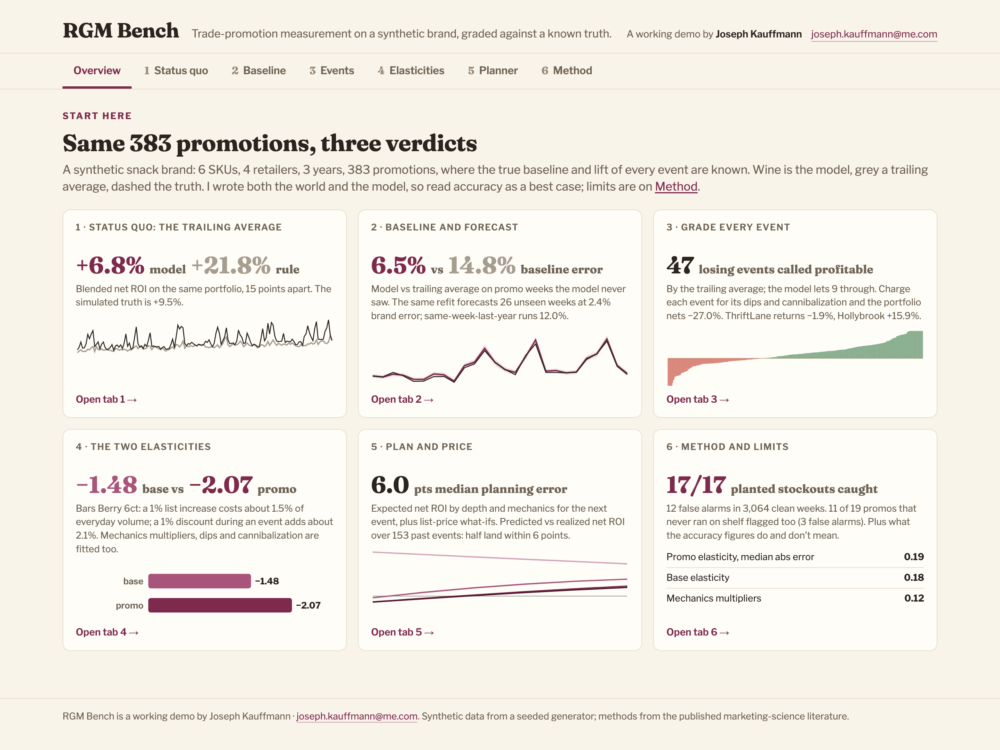
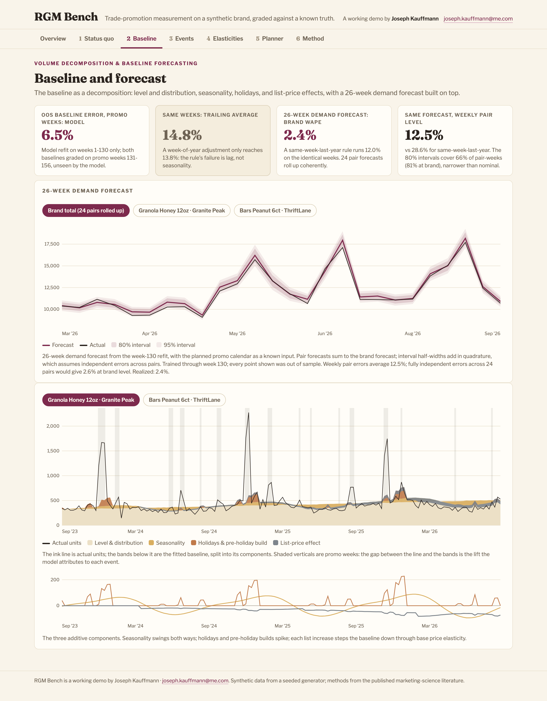
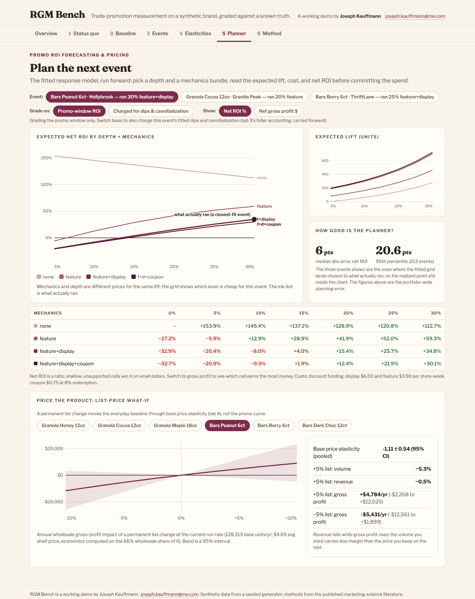

# RGM Bench

Promotion-effectiveness measurement for CPG brands, demonstrated end to end on synthetic
data: demand forecasting, baseline decomposition, event-level lift and net ROI split by
mechanic, base vs promotional price elasticity, cannibalization and promo dips, trade
efficiency, list-price what-ifs, and counterfactual promo planning. A dashboard landing
page carries each view's headline.

**Nothing to install. The screenshots below show the three charts the whole thing turns
on, and the live demo is one click:** https://JosephKauffmann.github.io/rgm-bench/

## Why synthetic data

On real data you can never check a baseline, because the counterfactual ("what would have
sold without the promo") is unobservable. This demo inverts that. The world is simulated:
seasonality, holiday and pre-holiday demand, a tiered trade calendar with
display/feature/coupon mechanics, staggered list-price increases, pre- and post-promo
dips, distribution growth, cannibalization, execution failures. So the true baseline and
every true parameter are known, and the measurement engine is graded against truth, out
of sample.

Three baseline methods are graded head-to-head:

| Baseline error on promo weeks (out-of-sample) | MAPE |
|---|---|
| Naive trailing-median rule | 14.8% |
| Trailing median with a week-of-year adjustment | 13.8% |
| Fitted response model | **6.5%** |

The seasonal adjustment recovers less than a point, and that is the point: a trailing
window's failure on promo weeks is not seasonality, it is lag. It is always behind a
baseline that trends, ramps into summer, and dips after every event. The naive rule
grades **66 of 383** events on the wrong side of breakeven and calls 47 losing events
profitable; the model grades 24 wrong and lets 9 through. And because the world's
parameters are known, recovery is checkable: promotional price elasticity within 0.19
(median abs error), base price elasticity within 0.185, mechanics multipliers within 0.12,
cannibalization recovered at −12.4% against a planted −12%, pre and post-promo dips
within about a point. Two anomaly detectors run before anything is measured, both graded:
17 of 17 planted stockout weeks caught (12 false alarms), and 11 of the 19 planted
execution-failure promos (3 false alarms); the misses are shallow, no-mechanic events
that hide below the noise floor.

The same holdout, worn as a forecast: a 26-week demand forecast with the planned promo
calendar as a known input runs at 12.5% weekly MAPE per SKU-retailer and **2.4% WAPE at
brand level** once the 24 pair forecasts roll up; a same-week-last-year rule runs 28.6%
and 12.0% on the identical weeks. The 80% intervals cover 66% of weeks at pair level
(81% at brand level); plug-in intervals run too confident, and the app says so on the
chart.

One more number, because it is the one a CFO asks about: graded on the promo window alone
the portfolio reads +6.8% blended net ROI. Charge each event for its anticipation dip,
its pantry-loading dip, and its sibling cannibalization, and it flips to −27%, with 81%
of events below breakeven. That flip is the argument for measuring dips at all.

## What the model separates (that an imported base/incremental split doesn't)

- **Base vs promotional price elasticity.** A list-price change and a temporary discount
  are different levers with different curves. Base PE is identified by pooling across
  retailers: the staggered timing of list increases is what separates a price effect
  from trend.
- **Mechanics.** Display, feature, and coupon each get their own multiplier, so every
  event's lift decomposes into a waterfall: depth + display + feature + coupon.
- **Dips.** The deal-anticipation dip the week before and the pantry-loading dip the week
  after, both priced into event economics alongside sibling cannibalization.
- **Execution failures and stockouts.** Promo weeks with no measured response and calm
  weeks that collapse below the baseline are flagged, graded against the planted truth,
  and excluded, instead of silently attenuating every elasticity.
- **Both levers, priced.** A depth × mechanics ROI planner for the next event, and a
  list-price what-if from the pooled base elasticity for the everyday shelf, each with
  its uncertainty attached, plus a banner × SKU trade-efficiency matrix.

## Screenshots







## What's in here

- `generator.py` builds the synthetic world: 6 SKUs × 4 retailers × 3 years of weekly POS
  with a known ground-truth demand process (log-linear), a tiered promo calendar anchored
  to national ad weeks with display/feature/coupon mechanics, charm-price ladders with
  staggered list increases, pre-holiday demand builds, pre/post-promo dips, distribution
  growth with one mid-series launch, and a 5% rate of execution-failure promos.
- `model.py` is the measurement engine: SCAN*PRO-family log-linear regression per
  SKU-retailer (Wittink et al.; Van Heerde & Neslin, *Sales Promotion Models*, Handbook
  of Marketing Decision Models), base price elasticity pooled across banners, a robust
  second pass over suspected non-executing promos, Duan (1983) smearing retransformation,
  event metrics under standard Base/Lift/ROI conventions (ROI is net: breakeven 0%),
  per-event mechanics waterfalls, fitted dip and cannibalization costs, an out-of-sample
  holdout, and counterfactual depth × mechanics grids.
- `tests.py` is every check the engine has to pass: data realism, formula fidelity
  recomputed by hand, recovery tolerances for both elasticities and all three mechanics,
  waterfall and decomposition identities, naming and provenance guards. It prints the
  count when you run it.
- `data/` holds the generated CSVs and the JSON consumed by the front-end.
- `index.html` is the demo app: one hand-written file, no frameworks, no build step, no
  dependencies. Every chart is hand-rolled SVG and every number is read from the embedded
  JSON. Open it locally or serve it from any static host.
- `build_html.py` re-embeds `data/app_data.json` into `index.html` after a regeneration
  (the test suite fails if the page's data goes stale).

## Run it

```bash
uv run --with pandas --with numpy python3 generator.py
uv run --with pandas --with numpy python3 model.py
python3 build_html.py
uv run --with pandas --with numpy python3 tests.py
```

## Limitations

The synthetic world and the model share an author, and the model is correctly specified
for this world. Read the accuracy numbers as a demonstration floor, not a production
forecast. The naive comparator is a trailing-median rule, an illustrative reference, not
any vendor's method. Base price elasticity is the weakest-identified number here (three
list increases per retailer is thin evidence; the confidence bands in the demo say so,
and the cross-SKU ordering should not be over-read). The pooled base elasticity is
plugged into the per-pair fits as a known value, so the baselines do not carry its
uncertainty.
On real data the same fit would need autocorrelation-robust errors, promotion-response
nonlinearities, and a lot more skepticism about the promo flags.

## Provenance

All data is synthetic, from the seeded generator in this repo. Methods are from the
published marketing-science literature. No employer data, systems, code, or client
information is used or referenced.

---

Joseph Kauffmann · New York · joseph.kauffmann@me.com
